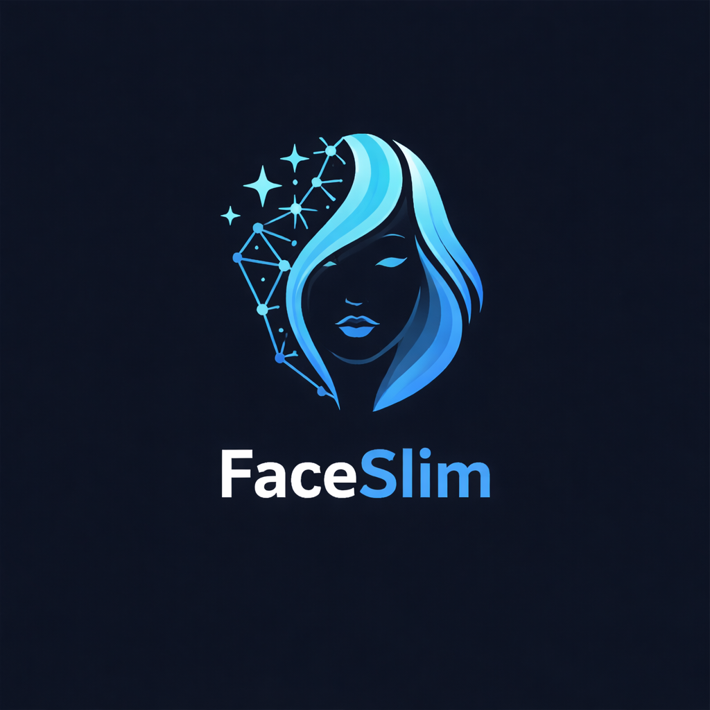

<!-- codex-branding:start -->
<p align="center"></p>

<p align="center">
  
  
  
</p>
<!-- codex-branding:end -->

# FaceSlim


> AI-powered face slimming, reshaping, and beautification suite with real-time preview, GPU acceleration, and CLI batch processing. 

## Quick Start

```bash
git clone https://github.com/SysAdminDoc/FaceSlim.git
cd FaceSlim
python FaceSlim_v1.py
```

Everything is automatic. On first launch, FaceSlim bootstraps PyQt5, OpenCV, MediaPipe, ONNX Runtime, scipy, and Pillow, then downloads the face landmarker (~3.7 MB) and BiSeNet parsing model (~50 MB).

## Features

### Face Reshaping (Warp-Based)

| Feature | Description | Method |
|---------|-------------|--------|
| Jaw Slimming | Narrows the jawline | TPS warp toward face center |
| Cheek Slimming | Reduces cheek fullness | TPS warp toward face center |
| Chin Reshape | Lifts and narrows the chin | TPS warp with vertical bias |
| Overall Width | Reduces overall face width | Full jaw contour inward warp |
| Forehead Slim | Narrows the forehead | TPS warp on forehead landmarks |
| Nose Slim | Narrows the nose bridge and tip | Horizontal-only warp toward nose centerline |
| Eye Enlarge | Enlarges eyes from iris center | Radial outward push on eye contour |
| Lip Plump | Plumps lips outward | Directional push (upper=up, lower=down) + radial |

### AI Beauty (BiSeNet Parsing-Based)

| Feature | Description | Method |
|---------|-------------|--------|
| Skin Smoothing | Smooths skin while preserving texture | Frequency-separation bilateral filter on skin-only mask |
| Skin Tone Even | Reduces redness and blotchiness | LAB color correction + mean-color blending |
| Teeth Whitening | Brightens teeth naturally | HSV saturation/brightness on mouth interior only |
| Eye Sharpen | Sharpens iris and brow detail | Unsharp mask on eye/brow parsing region |
| Lip Color | Boosts lip saturation and warmth | HSV saturation boost on lip parsing region |

### Pipeline & Performance

| Feature | Description |
|---------|-------------|
| BiSeNet Face Parsing | 19-class pixel-level segmentation via ONNX Runtime |
| Background Protection | ROI-isolated warp + seamless clone composite |
| Temporal Mask Smoothing | EMA filter prevents parsing mask flicker on video |
| Optical Flow Propagation | Warp displacement propagation between TPS keyframes |
| GPU Acceleration | PyTorch TPS warping on CUDA (auto-detected) |
| Multi-Face Support | Up to 5 simultaneous faces with per-face caching |
| Real-Time Preview | Webcam/video with live slider adjustment |
| A/B Compare | Draggable split-screen before/after overlay |
| Batch Processing | Folder/multi-file image and video processing |
| CLI Mode | Headless with presets and per-param control |
| Preset System | 9 built-in + unlimited custom presets (JSON) |
| Before/After GIF | One-click animated comparison export |
| Drag & Drop | Drop images/videos directly onto the window |
| Undo/Redo | 50-level parameter history |
| Settings Persistence | Slider values saved between sessions |

## How It Works

```
┌──────────────┐    ┌───────────────┐    ┌───────────────┐    ┌──────────────┐
│ Input Frame  │───>│  MediaPipe    │───>│  TPS Warp     │───>│  Post-Warp   │
│  (RGB)       │    │ 478 Landmarks │    │  (GPU/CPU)    │    │  Effects     │
│              │    │  + One-Euro   │    │  ROI-isolated │    │              │
│              │    │  filtering    │    │  + Seamless   │    │  BiSeNet     │
│              │    │               │    │  Clone        │    │  Parsing     │
└──────────────┘    └───────────────┘    └───────────────┘    └──────┬───────┘
                    ┌───────────────┐    ┌───────────────┐           │
                    │  Output Frame │<───│  Skin Smooth  │<──────────┘
                    │  (RGB)        │    │  Tone Even    │
                    │               │    │  Teeth Whiten │
                    │               │    │  Eye Sharpen  │
                    │               │    │  Lip Color    │
                    └───────────────┘    └───────────────┘

Video Mode Only:
┌──────────────────────────────────────────────┐
│  Optical Flow Propagator                     │
│  Keyframe (every 4 frames) → full TPS solve  │
│  Interim frames → Farneback flow warp of     │
│  cached displacement field                   │
└──────────────────────────────────────────────┘
```

## Usage

### GUI Mode

```bash
python FaceSlim_v1.py
```

The interface has three tabs: **Reshape** (sliders for all effects), **Presets** (built-in/custom preset management), and **Export** (video export, screenshots, batch, GIF).

### CLI Mode

```bash
# Single image with preset
python FaceSlim_v1.py --input photo.jpg --preset Moderate

# AI beauty only
python FaceSlim_v1.py --input photo.jpg --preset Beauty

# Full glamour (reshaping + beauty)
python FaceSlim_v1.py --input photo.jpg --preset Glamour

# Custom parameters
python FaceSlim_v1.py --input video.mp4 --jaw 50 --eye-enlarge 30 --lip-plump 20 --skin-smooth 40

# Batch folder processing
python FaceSlim_v1.py --input ./photos/ --output ./results/ --preset Strong

# Multi-face processing
python FaceSlim_v1.py --input group.jpg --faces 3 --preset "Full Sculpt"

# List available presets
python FaceSlim_v1.py --list-presets
```

### CLI Arguments

| Argument | Type | Description |
|----------|------|-------------|
| `--input`, `-i` | path(s) | Input image(s), video(s), or folder(s) |
| `--output`, `-o` | path | Output directory (default: `faceslim_output/`) |
| `--preset`, `-p` | string | Named preset (built-in or custom) |
| `--jaw` | 0-100 | Jawline slimming |
| `--cheeks` | 0-100 | Cheek slimming |
| `--chin` | 0-100 | Chin reshaping |
| `--face-width` | 0-100 | Face width reduction |
| `--forehead` | 0-100 | Forehead narrowing |
| `--nose` | 0-100 | Nose slimming |
| `--eye-enlarge` | 0-100 | Eye enlargement |
| `--lip-plump` | 0-100 | Lip plumping |
| `--skin-smooth` | 0-100 | AI skin smoothing |
| `--skin-tone-even` | 0-100 | AI skin tone evening |
| `--teeth-whiten` | 0-100 | AI teeth whitening |
| `--eye-sharpen` | 0-100 | AI eye sharpening |
| `--lip-color` | 0-100 | AI lip color enhancement |
| `--smoothing` | 10-100 | Warp field smoothness |
| `--faces` | 1-5 | Max faces to process |
| `--list-presets` | flag | List all available presets |

### Built-In Presets

| Preset | Focus | Key Parameters |
|--------|-------|----------------|
| Subtle | Light face slimming | jaw=15, cheeks=10 |
| Moderate | Balanced slimming | jaw=35, cheeks=25, chin=15 |
| Strong | Aggressive slimming | jaw=60, cheeks=45, chin=30 |
| V-Shape | Jaw-focused sculpting | jaw=70, chin=40 |
| Oval | Rounded face shape | jaw=40, cheeks=35, face_width=30 |
| Slim Nose | Nose only | nose=50 |
| Full Sculpt | All reshaping combined | jaw=50, cheeks=40, nose=30 |
| Beauty | AI beautification only | skin_smooth=40, teeth=20, eyes=30, lips=20 |
| Glamour | Full reshaping + beautification | All effects combined |

## Configuration

Custom presets are stored as JSON in:

| OS | Location |
|----|----------|
| Windows | `%APPDATA%\.faceslim\presets\` |
| macOS/Linux | `~/.faceslim/presets/` |

Slider values persist between sessions via Qt settings. Crash logs are written to `crash.log` in the application directory.

## Models (Auto-Downloaded)

| Model | Size | Source | Purpose |
|-------|------|--------|---------|
| `face_landmarker.task` | ~3.7 MB | Google MediaPipe | 478-point face landmarks |
| `bisenet_face_parsing.onnx` | ~50 MB | [yakhyo/face-parsing](https://github.com/yakhyo/face-parsing) | 19-class face segmentation (CelebAMask-HQ) |

Both models are downloaded automatically on first run. If the BiSeNet model fails to download, the app falls back to landmark-based polygon masking (reshaping still works, AI beauty effects are disabled).

## Requirements

- **Python 3.9+**
- **Auto-installed:** PyQt5, OpenCV, MediaPipe, ONNX Runtime, scipy, Pillow
- **Optional:** PyTorch + CUDA for GPU acceleration (auto-detected)
- **Optional:** FFmpeg for audio muxing on video exports

## Supported Formats

| Type | Extensions |
|------|------------|
| Images | `.jpg` `.jpeg` `.png` `.bmp` `.tiff` `.tif` `.webp` |
| Videos | `.mp4` `.avi` `.mov` `.mkv` `.webm` `.wmv` `.flv` `.m4v` |

## FAQ / Troubleshooting

**BiSeNet model fails to download**
The app falls back to landmark-based masking automatically. AI beauty effects (skin smooth, teeth whiten, etc.) require the BiSeNet model. You can manually download `resnet18.onnx` from the [face-parsing releases](https://github.com/yakhyo/face-parsing/releases) and rename it to `bisenet_face_parsing.onnx` in the app directory.

**Low FPS in real-time preview**
Use the Preview Scale dropdown (75% or 50%) in the Quality group. Install PyTorch with CUDA for GPU acceleration. Optical flow propagation kicks in automatically for video, computing full TPS only every 4th frame.

**Warp affects the background**
Increase the Background Protection slider. At 70+ (default), warping is confined to the face ROI and blended back with seamless clone.

**Video export has no audio**
Install FFmpeg and make sure it's on your PATH. FaceSlim automatically muxes audio from the original file when FFmpeg is available.

**Faces not detected**
Ensure the face is reasonably front-facing and well-lit. MediaPipe requires a minimum face size — try loading a higher resolution source. For multi-face scenes, increase Max Faces (up to 5).

**Crash on startup**
Check `crash.log` in the application directory. Common causes: incompatible Python version (<3.9), missing system libraries for PyQt5 on Linux (install `libxcb-xinerama0`), or corrupted model files (delete `.task`/`.onnx` files and relaunch to re-download).

## License

MIT License. See [LICENSE](LICENSE) for details. Issues and PRs welcome.
